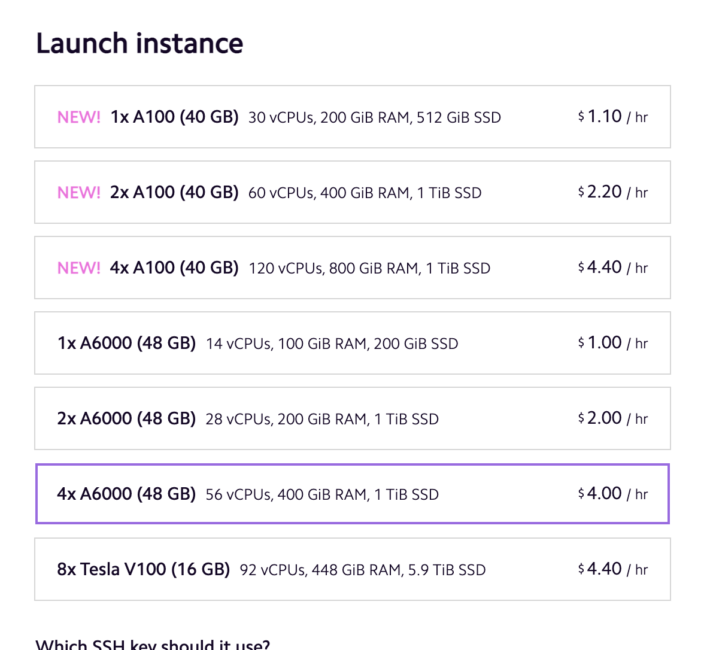
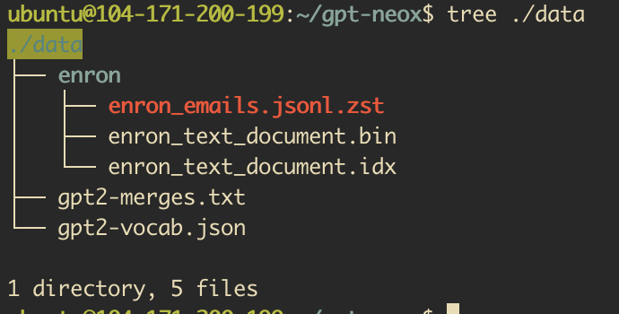
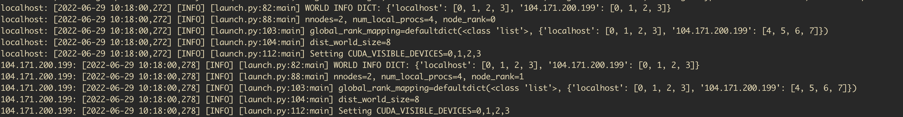

# Large Language Model Multi-Node Distributed Training

In this example we will show how to train a large language model on multiple nodes on Lambda Cloud. We will use the open-source gpt-neox repository, which is built on DeepSpeed and MegatronLM.

## Pre-requisites

To run this tutorial you should be familiar with working at the command line as we will be connecting and issuing instructions to our machines using ssh (Note this example isn't suitable for running from a Jupyter notebook).
This example will use two instances (nodes) to demonstrate multi-node training, for a real training job you may want to scale up the computational resources.

## TODO On-demand vs. reserved setup differences

TODO (currently on-demand)

## Machine creation

First spin up 2, 4xA6000 instances using the Lambda Cloud web interface.




> We don’t need to attach storage as we will use a different mechanism for sharing data between the two, but it might be useful for storing your trained models if you want.

One node will be our __head__ node and the other will be the __worker__. Decide which one is which and make sure to run the right steps on each. If we were working with more nodes we would simply have more workers.

## Machine setup

### Both nodes

First we will run some common steps on both nodes to set up our environment. Execute the following on both nodes: 

Clone the gpt-neox repo and change working directory

```bash
git clone https://github.com/EleutherAI/gpt-neox.git
cd gpt-neox
```

Install pybind11 to ensure we can build the custom cuda kernels

```bash
sudo apt-get install -y python3-pybind11
```

Install Python dependencies (all fix a dependency issue with a recently released version of protobuf)

```
pip install -r requirements/requirements.txt
sudo python ./megatron/fused_kernels/setup.py install
pip install protobuf==3.20.1
```

### Head node setup

Now we need specific set up on the head and worker nodes. Make sure you note the IP address of both nodes. The first thing we need to do is to ensure that we can share data between both machines. We will be using the example enron data provided in the gpt-neox repo, but need a place to store it that both machines can access, in order to do this we will set up nfs on the head node and share with the worker.

We cannot used the shared storage in Lambda cloud for this purpose as the default dataset type in gpt-neox relies on memory mapped files, and this is not compatible with our storage solution.

On the head node, install nfs server:

```bash
sudo apt install -y nfs-kernel-server
```

Then create a directory and allow this to be shared with our worker

```bash
WORKER_IP=104.171.200.199

sudo mkdir ./data
sudo chmod 777 ./data
printf "${PWD}/data ${WORKER_IP}(rw,sync,no_subtree_check)" | sudo tee -a /etc/exports
sudo systemctl restart nfs-kernel-server
```

Finally we will run the python script provided in the repo to download and prepare the dataset

```bash
python prepare_data.py -d ./data
```

### Worker node setup

On the worker we have a simpler task.

First we install the nfs client:

```bash
sudo apt install -y nfs-common
```

Then mount the directory we shared above on the head node

```bash
HEAD_IP=104.171.200.190

sudo mkdir ./data
sudo mount ${HEAD_IP}:${PWD}/data ./data
```

Finally we want to make sure that we can see the data we have downloaded on the head node from the worker.

```bash
tree ./data
```



## Training

### Single node

We are ready to start training our GPT-NeoX model! For this step we will use the pre-configured configuration files in ./configs. We will use a (relatively) small 2.7 billion parameter model for our training, but larger models should fit in our GPU memory.

First up we will simply launch training on the head node to make sure that everything works, this will use the 4x A6000 GPUs on our head node. The existing configs 2-7B.yml defines the model parameters we want and the local_setup.yml config already points to the example data we will use.

Launch training on the head node with: 

```bash
python ./deepy.py train.py configs/2-7B.yml configs/local_setup.yml
```

You should see the training logs start to print and training commences. You can check nvidia-smi to ensure that the GPUs are working hard.



You will probably see lots of log messages initially about adjusting the loss scale. This is expected and is due to reduced precision training used.

### Multi node

#### SSH between the nodes

Assuming everything worked on one node we are ready to scale up training! In order to use both our nodes we have to tell the head node about the existence of our worker. Once we have done this everything will be driven from the head node, who will remotely execute commands on the worker.

To do this gpt-neox (via deepspeed) uses pdsh by default to runs command via ssh. This means first off we need to install pdsh on the head node only

```bash
sudo apt-get install -y pdsh
```

We also need to ensure that pdsh behaves correctly in using ssh (rather than rsh) and correctly sets the path when executing remote commands, by setting two environment variables also on the head node.

```bash
export DSHPATH=$PATH
export PDSH_RCMD_TYPE=ssh
```

Now we need to ensure that the head node can use ssh to communicate to both the worker and itself. On these instances ssh authorization is via public/private key. We’ve got two options to do this, either you can copy your private key from the local machine you are using to connect to both the nodes. Alternatively we can create a new key pair to use, this is what we will do below.

First we need to create the key pair on the head node (don’t use a passphrase otherwise we will also have to set up ssh agent as well)

```bash
ssh-keygen
```

Next we append the public key to the authorized_keys on the head node (so it can access itself)

```bash
cat ~/.ssh/id_rsa.pub >> ~/.ssh/authorized_keys
```

Finally we need to append the public key from the head node to the authorized_keys of the worker node. As you are working from your local machine that can access both nodes, run the following on your local machine

```bash
HEAD_IP=104.171.200.190
WORKER_IP=104.171.200.199
ssh ubuntu@$HEAD_IP "cat ~/.ssh/id_rsa.pub" | ssh ubuntu@$WORKER_IP "cat >> ~/.ssh/authorized_keys"
```

Now passwordless ssh access should be setup from the head node to the worker and from the head node to itself, double check both of these: `ssh localhost` and `ssh $WORKER_IP`

### Setup hostfile

Finally we actually need to tell the head node that there is a worker we want to use. We do this using a hostfile which specifies IP addresses and numbers of GPUs (slots) on each. The default location gpt-neox looks for this file is in `/job/hostfile`

Create the hostfile using an editor, or with the following commands

```bash
N_GPUS=4
sudo mkdir /job
printf "localhost slots=$N_GPUS\n$WORKER_IP slots=$N_GPUS" | sudo tee /job/hostfile
```

You should now see a hostfile in `/job/hostfile` that looks like:

```
localhost slots=4
104.171.200.199 slots=4
```

Now you should be ready to train on 2 nodes! 

The command is the same. It’s the presence of the `/job/hostfile` that tells it we’re doing multi-node training. 

```bash
python ./deepy.py train.py configs/2-7B.yml configs/local_setup.yml
```

All being well you should see training commence and during the logs you will see entries from both the head node and the worker, and all devices should be used.


