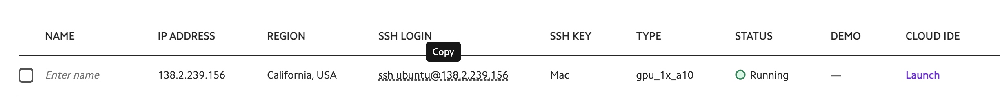

# Fine tuning Meta's LLaMA 2 on Lambda GPU Cloud

## Getting access to the models

Both meta and huggingface need to grant you access to download the models:

1. Request access from Meta here: https://ai.meta.com/resources/models-and-libraries/llama-downloads/
2. Request access from huggingface on any of the model pages: https://huggingface.co/meta-llama/Llama-2-7b
3. Set up an auth token with huggingface here: https://huggingface.co/settings/tokens. You'll use this later.

## Spin up a GPU machine (you can use an A10!)

You can go to https://cloud.lambdalabs.com/instances and select whatever instance type you want to start fine tuning the llama models. For the 7b parameter variant, you can go as small as an A10 (24GB GPU ram).

Assuming you've also set up an ssh key at https://cloud.lambdalabs.com/ssh-keys, once the machine starts up you can just copy/paste the ssh command associated with the machine and run that in a terminal:



## Set up environment

1. Install python packages

```bash
pip install transformers peft trl bitsandbytes
```

2. Download `trl` repo for the training script (https://github.com/lvwerra/trl/blob/main/examples/scripts/sft_trainer.py)

```bash
git clone https://github.com/lvwerra/trl
```

3. Log into huggingface on CLI

```bash
huggingface-cli login
```

Copy the auth token you created earlier (from https://huggingface.co/settings/tokens) and paste it into the prompt.

## Fine tune!

```bash
python trl/examples/scripts/sft_trainer.py \
    --model_name meta-llama/Llama-2-7b-hf \
    --dataset_name timdettmers/openassistant-guanaco \
    --load_in_4bit \
    --use_peft \
    --batch_size 4 \
    --gradient_accumulation_steps 2
```

This will download the model weights automatically, so the first time you run, it will take a bit to actually start training.

You should end up seeing output like this:

```bash
...
{'loss': 1.6493, 'learning_rate': 1.4096181965881397e-05, 'epoch': 0.0}                                                                        
{'loss': 1.3571, 'learning_rate': 1.4092363931762796e-05, 'epoch': 0.0}                                                                        
{'loss': 1.5853, 'learning_rate': 1.4088545897644193e-05, 'epoch': 0.0}                                                                        
{'loss': 1.4237, 'learning_rate': 1.408472786352559e-05, 'epoch': 0.0}                                                                         
{'loss': 1.7098, 'learning_rate': 1.4080909829406987e-05, 'epoch': 0.0}                                                                        
{'loss': 1.4348, 'learning_rate': 1.4077091795288384e-05, 'epoch': 0.0}                                                                        
{'loss': 1.6022, 'learning_rate': 1.407327376116978e-05, 'epoch': 0.01}                                                                        
{'loss': 1.3352, 'learning_rate': 1.4069455727051177e-05, 'epoch': 0.01}
...
```
