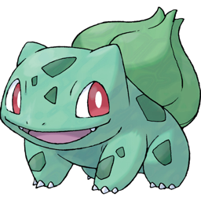
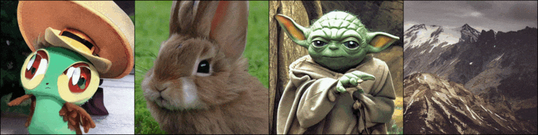
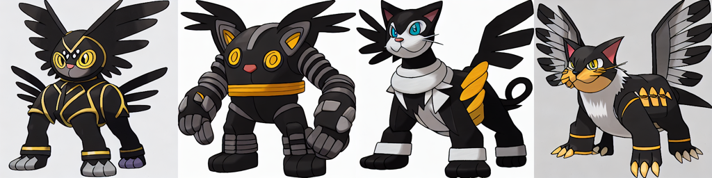

# Fine Tuning Stable Diffusion

Stable Diffusion is great at many things, but not great at everything, and getting results in a particular style or appearance often involves a lot of work "prompt engineering". If you have a particular type of image you'd like to generate, then an alternative to spending a long time crafting an intricate text prompt is to actually fine tune the image generation model itself.

Fine tuning is the common practice of taking a model which has been trained on a wide and diverse dataset, and then training it a bit more on the dataset you are specifically interested in. This is common practice on deep learning and has been shown to be tremendously effective all manner of models from standard image classification networks to GANs. In this example we'll show how to fine tune Stable Diffusion on a Pokémon dataset to create a text to image model which makes custom Pokémon based on any text prompt.

Here are some examples of the sort of outputs the trained model can produce, and the prompt used:


> Girl with a pearl earring, Cute Obama creature, Donald Trump, Boris Johnson, Totoro, Hello Kitty

If you're just after the model, code, or dataset, see:

- [Lambda Diffusers](https://github.com/LambdaLabsML/lambda-diffusers)
- [Captioned Pokémon dataset](https://huggingface.co/datasets/lambdalabs/pokemon-blip-captions)
- [Model weights in Diffusers format](https://huggingface.co/lambdalabs/sd-pokemon-diffusers)
- [Original model weights](https://huggingface.co/justinpinkney/pokemon-stable-diffusion)
- [Training code](https://github.com/justinpinkney/stable-diffusion)

If you just want to generate some Pokémon use [this notebook](https://github.com/LambdaLabsML/lambda-diffusers/blob/main/notebooks/pokemon_demo.ipynb) or try it out on [Replicate](https://replicate.com/lambdal/text-to-pokemon).

## Hardware

Running Stable Diffusion itself is not too demanding by today's standards, and fine tuning the model doesn't require anything like the hardware on which it was originally trained. For this example I'm using 2xA6000 GPUs on [Lambda GPU Cloud](https://lambdalabs.com/service/gpu-cloud) and run training for around 15,000 steps which takes about 6 hours to run, at a cost of about $10. Training should be able to run on a single or lower spec GPUs (as long as there is >24GB of VRAM), but you might need to adjust batch size and gradient accumulation steps to fit your GPU. For more details on how to adjust these parameters see the [fine-tuning notebook](pokemon_finetune.ipynb).

## Data!

First off we need a dataset to train on. Stable Diffusion training needs images each with an accompanying text caption. Things are going to work best if we choose a specific topic and style for our dataset, in this case I'm going to use the [Pokémon dataset from FastGAN](https://github.com/odegeasslbc/FastGAN-pytorch) as it's a decent size (almost a thousand images), high resolution, and has a very consistent style, also who hasn't always wanted to generate their own Pokémon? But there's one problem, it doesn't have any captions for the images!

Instead of painstakingly writing out captions ourselves we're going to use a neural network to do the hard work for us, specifically an image captioning model called [BLIP](https://github.com/salesforce/BLIP). (But if any Pokémon enthusiasts feel like writing some captions manually please get in touch!). The captions aren't perfect, but they're reasonably accurate and good enough for our purposes.

We've uploaded our captioned Pokemon dataset to Huggingface to make it easy to reuse: [lambdalabs/pokemon-blip-captions](https://huggingface.co/datasets/lambdalabs/pokemon-blip-captions).


```python
from datasets import load_dataset
ds = load_dataset("lambdalabs/pokemon-blip-captions", split="train")
sample = ds[0]
display(sample["image"].resize((256, 256)))
print(sample["text"])
```



    a drawing of a green pokemon with red eyes


## Get ready

Now we have a dataset we need the original model weights which are available for [download here](https://huggingface.co/CompVis/stable-diffusion-v-1-4-original), listed as `sd-v1-4-full-ema.ckpt`.
Next we need to set up the code and environment for training. We're going to use a fork of the original training code which has been modified to make it a bit more friendly for fine-tuning purposes: [justinpinkney/stable-diffusion](https://github.com/justinpinkney/stable-diffusion).

Stable Diffusion uses yaml based configuration files along with a few extra command line arguments passed to the `main.py` function in order to launch training.

We've created a [base yaml configuration file](https://github.com/justinpinkney/stable-diffusion/blob/main/configs/stable-diffusion/pokemon.yaml) that runs this fine-tuning example. If you want to run on your own dataset it should be simple to modify, the main part you would need to edit is the data configuration, here's the relevant excerpt from the custom yaml file:

```yaml
data:
  target: main.DataModuleFromConfig
  params:
    batch_size: 4
    num_workers: 4
    num_val_workers: 0 # Avoid a weird val dataloader issue
    train:
      target: ldm.data.simple.hf_dataset
      params:
        name: lambdalabs/pokemon-blip-captions
        image_transforms:
        - target: torchvision.transforms.Resize
          params:
            size: 512
            interpolation: 3
        - target: torchvision.transforms.RandomCrop
          params:
            size: 512
        - target: torchvision.transforms.RandomHorizontalFlip
    validation:
      target: ldm.data.simple.TextOnly
      params:
        captions:
        - "A pokemon with green eyes, large wings, and a hat"
        - "A cute bunny rabbit"
        - "Yoda"
        - "An epic landscape photo of a mountain"
        output_size: 512
        n_gpus: 2 # small hack to make sure we see all our samples
```

This part of the config basically does the following things it uses the `ldm.data.simple.hf_dataset` function to create a dataset for training from the name `lambdalabs/pokemon-blip-cpations` this is on the Huggingface Hub but could also be a correctly formatted local directory. For validation we don't use a "real" dataset, but just a few text prompts to evaluate how well our model is doing and when to stop training, we want to train enough to get good outputs, but we don't want it to forget all the "general knowledge" from the original model.

## Train!

Once the config file is set up you're ready to train by running the `main.py` script with a few extra arguments:

- `-t` - Do training
- `--base configs/stable-diffusion/pokemon.yaml` - Use our custom config
- `--gpus 0,1` - Use these GPUs
- `--scale_lr False` - Use the learn rate in the config as is
- `--num_nodes 1` - Run on a single machine (possibly with multiple GPUs)
- `--check_val_every_n_epoch 10` - don't check the validation samples too often
- `--finetune_from models/ldm/stable-diffusion-v1/sd-v1-4-full-ema.ckpt` - Load from the original Stable Diffusion

```bash
python main.py \
    -t \
    --base configs/stable-diffusion/pokemon.yaml \
    --gpus 0,1 \
    --scale_lr False \
    --num_nodes 1 \
    --check_val_every_n_epoch 10 \
    --finetune_from sd-v1-4-full-ema.ckpt
```

## Results

During training results should be logged to the the `logs` folder, you should see samples taken every so often from the training dataset and all the validation samples should be run. At the start sample looks like normal image, then start to get a Pokemon style, and eventually diverge from the original prompts as training continues:



If we want to use the model we can do so in the normal way, for example using the `txt2img.py` script, just modifying the checkpoint we pass to be our fine tuned version rather than the original:

```bash
python scripts/txt2img.py \
    --prompt 'robotic cat with wings' \
    --outdir 'outputs/generated_pokemon' \
    --H 512 --W 512 \
    --n_samples 4 \
    --config 'configs/stable-diffusion/pokemon.yaml' \
    --ckpt 'logs/2022-09-02T06-46-25_pokemon_pokemon/checkpoints/epoch=000142.ckpt'
```

```python
from PIL import Image
im = Image.open("outputs/generated_pokemon/grid-0000.png").resize((1024, 256))
display(im)
print("robotic cat with wings")
```



    robotic cat with wings


This model should compatible with any of the existing repos or user interfaces being developed for Stable Diffusion, and can also be ported to the Huggingface Diffusers library using a [simple script](https://github.com/justinpinkney/stable-diffusion/blob/main/scripts/convert_sd_to_diffusers.py).

If you just want a simple starting point for running this example from start to finish in a notebook take a [look here](pokemon_finetune.ipynb).

## Plugging in your own data

If you want to use your own data for training then the simplest way is to format it in the right way for huggingface datasets, if your dataset returns `image` and `text` columns then you can re-use the existing config but just change the dataset name to your own.

## Conclusion

Now you know how to train your own Stable Diffusion models on your own datasets! If you train some interesting models please reach out and let us know either in the [Issues](https://github.com/LambdaLabsML/examples/issues) section or on [Twitter](https://twitter.com/LambdaAPI), or check out some of [our other experiments](https://huggingface.co/lambdalabs/sd-image-variations-diffusers) with Stable Diffusion.
